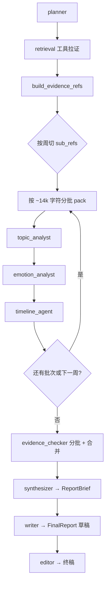

# 月报生成：Agent 流程与提示词说明

本文档描述 `report_type=monthly` 时，`iter_report_pipeline` 的完整阶段、各 Agent 的 **system / user 提示词**、**输入构造方式**与 **输出结构**。实现源码见 `app/services/reports/`。

---

## 1. 总流程（月报）

月报在编排器中会先按自然周拆分子区间（每段最多 7 天），再对每一周（及周内多批证据）依次跑分析 Agent。

**公共机制**

- 所有「分析类」LLM 调用均通过 `complete_json_model`：一次 `chat.completions`，**system** + **user**，模型须返回 **JSON**，解析后校验为对应 Pydantic 模型；解析/校验失败时回退为该模型的**空默认值**（各字段默认空）。
- 证据文本格式：`pack_evidence_for_llm` 生成多行，每行形如  
  `[索引] {ref_key} day={day_key} {excerpt}`，单条 `excerpt` 最长约 320 字符（见 `build_evidence_refs`）。
- 月报单批证据上限：`EVIDENCE_CHARS_PER_LLM_BATCH = 14000`（`orchestrator.py`）；单批打包给模型时 `max_chars` 可放宽到约 18000。
- Planner 产出的 `retrieval_keywords`（若有）会写回 `StructuredQuery.keywords`，影响后续工具内关键词分支（若启用）。

---

## 2. 阶段 0：检索（非 LLM Agent）

**入口**：`gather_report_evidence(..., mode="monthly")`（`retrieval.py`）

**顺序与工具**（去重键：`(source_type, source_ref_id)`，先出现者保留）：

| 顺序 | 工具 | 说明（月报） |
|------|------|----------------|
| 1 | `get_range_summaries` | 区间内全部 `daily_summaries` |
| 2 | `get_messages_by_range` | 区间内全部消息（无 SQL LIMIT） |
| 3 | `get_chunks_by_range` | 区间内全部 `conversation_chunks` |
| 4 | `get_quote_candidates` | 长消息优先 + 块，再合并 |
| 5 | `get_timeline_events` | 范围内消息 + 块，按时间排序 |

**输出**：`list[RetrievalCandidate]` → `build_evidence_refs` → `list[EvidenceRef]`。

---

## 3. Planner（`report_planner_agent`）

**文件**：`agents/report_planner_agent.py`  
**作用**：在静态管线模板之外，让模型补充检索关键词与规划备注；**不**改写编排器里写死的 `agents_pipeline`。

**输入（user 拼接）**

- `report_type=monthly`
- `couple_id=...`
- `date_range=YYYY-MM-DD..YYYY-MM-DD`
- 要求只输出 JSON：`retrieval_keywords[]`, `planner_notes`, `subtask_labels[]`（`subtask_labels` 可为空，与编排器里按周切的 `subtasks` 独立）

**System**

> 你是亲密关系报表分析的总规划助手，输出严格 JSON，不要臆造事实。

**温度**：0.25

**输出模型（LLM JSON）**：`_PlannerLLMFields`  
**落地为**：`ReportPlan`（`retrieval_keywords` 截断至 24 条、`planner_notes` 文本；`subtasks` 由编排器预填周区间）。

---

## 4. 分析三件套（按周 × 按批重复）

对**每一自然周**、**每一证据批次**顺序执行以下三个 Agent（输入均为当前批的 `evidence_pack` 字符串，并带 `scope_label`，如 `2026-03-01～2026-03-07 · 批次 2/3`）。

### 4.1 Topic Analyst（`topic_analyst_agent`）

**System**

> 你是文本主题分析师，只依据所给摘录下结论，语气中性。

**User 结构**

1. 说明：恋爱聊天记录证据摘录（带编号索引）+（范围：{scope_label}）
2. 要求：仅根据材料归纳主题；材料不足写入 `low_evidence_topics`
3. 拼接：`{evidence_pack}`
4. 输出 JSON 字段：`summary`, `main_topics[]`, `high_frequency_notes[]`, `low_evidence_topics[]`

**温度**：0.3

**下游**：`AgentFinding`（`agent_name=topic_analyst`），`bullet_points` 由 `main_topics` + `high_frequency_notes` 合并，`low_evidence_topics` 会前缀「证据不足项：」写入 `low_evidence_notes`。

---

### 4.2 Emotion Analyst（`emotion_analyst_agent`）

**System**

> 你是亲密关系情绪与支持行为分析师，克制、温暖、基于证据。

**User 结构**

1. 证据摘录 +（范围：{scope_label}）
2. 分析：整体氛围、支持行为、亲密互动、摩擦与缓和片段；禁止编造；证据不足写入 `low_evidence_emotion_claims`
3. `{evidence_pack}`
4. 输出 JSON：`summary`, `atmosphere`, `support_behaviors[]`, `intimacy_cues[]`, `friction_points[]`, `repair_or_warm_moments[]`, `mood_tags[]`, `low_evidence_emotion_claims[]`

**温度**：0.35

**下游**：`AgentFinding`（`agent_name=emotion_analyst`），`summary` 优先 `summary` 否则 `atmosphere`，`bullet_points` 为上述多字段扁平列表。

---

### 4.3 Timeline Agent（`timeline_agent`）

**System**

> 你是关系时间线分析师，只依据摘录，日期用 YYYY-MM-DD 或「约/某日」表述。

**User 结构**

1. 按时间顺序的聊天摘录索引 +（范围：{scope_label}）
2. 提取重要日期/阶段、关系演变；日期不明勿编造；不足写入 `low_evidence_timeline`
3. `{evidence_pack}`
4. 输出 JSON：`summary`, `key_dates[]`, `milestones[]`, `evolution_notes[]`, `low_evidence_timeline[]`

**温度**：0.3

**下游**：`AgentFinding`（`agent_name=timeline_agent`）。

---

## 5. Evidence Checker（`evidence_checker_agent`，周/月专有）

**触发**：仅 `weekly` / `monthly`；月报在**全部**分析类 finding 生成之后。

**批处理**：编排器对**全量** `refs` 按 `EVIDENCE_CHARS_PER_LLM_BATCH` 分批；第 2 批及以后会在 user 里附加「分析师阶段小结」_truncated（见 `_run_evidence_checker_batched`）。各批结果再 **`_merge_evidence_checker_findings`** 合成一条 `AgentFinding`。

**System**

> 你是事实核查员，保护用户免受过度推断，语气专业克制。

**User 结构**

1. `证据摘录（带编号）：` + `{evidence_pack}`（当前批）
2. `已有多位分析师结论汇总：` + `{prior_findings_summary}`（**整段** `_findings_to_text(findings)`，含此前所有 topic/emotion/timeline/check 片段；多批时后续批会对该文本做截断提示）
3. 任务：判断哪些结论证据偏弱或过度推断，哪些相对稳妥
4. 输出 JSON：`summary`, `under_supported_claims[]`, `suggested_soften_phrases[]`, `ok_claims[]`

**温度**：0.2

**下游**：`AgentFinding`（`agent_name=evidence_checker`），`bullet_points` = `under_supported_claims` + `suggested_soften_phrases`。

**`_findings_to_text` 格式**（供 synthesizer 与 checker 使用）

- 每个 finding：`## {agent_name}\n{summary}\n`，若有 `bullet_points` 则每行 `- ...`（最多 30 条），若有 `low_evidence_notes` 则拼「低证据：...」

---

## 6. Synthesizer（`report_synthesizer_agent`）

**作用**：把多位分析师的文本汇总为 **`ReportBrief`**，供 writer 使用。

**System**

> 你是总编辑助理，整合多源发现，不新增事实。

**User 结构**

1. `报表类型：monthly`
2. `规划备注：{plan_notes}`（来自 `ReportPlan.planner_notes`）
3. `各分析师发现（含低证据标注）：` + `{findings_text}`（整段 `_findings_to_text(findings)`）
4. 要求去重、统一语气；输出 JSON：`headline`, `overview`, `key_themes[]`, `emotion_arc`, `highlights[]`, `risks_or_friction[]`, `memory_moments[]`, `recommendations[]`, `evidence_gaps[]`；月报应保留关系向建议；`evidence_gaps` 必须列出材料不足处

**温度**：0.35

**输出**：`ReportBrief`（Pydantic）。

---

## 7. Writer（`report_writer_agent`）

**作用**：由 `ReportBrief` 生成长/短正文草稿 **`FinalReport`**。

**输入预处理**：`_brief_json_for_writer` — 将 `brief.model_dump` 递归截断字段长度，保证 JSON 字符串约 ≤ 22000 字符档级，避免模型输出被上下文挤爆。

**System**

> 你是亲密关系周报/月报主笔，温暖、具体、避免武断。body_web 必须写得充实。

**User 结构**

1. `报表类型：monthly`
2. `brief JSON（已控制长度，请据此写稿）：` + `{压缩后的 brief JSON}`
3. 要求：`title`；`body_web` 必须非空 markdown；`body_wechat` ≤600 字；`structured_sections` 与正文呼应；勿编造 brief 外事实；只输出一个 JSON 对象，键：`title`, `body_web`, `body_wechat`, `structured_sections`，不要 markdown 代码块外壳

**温度**：0.45

**输出**：内部 `_DraftOut` → `FinalReport`；若 `body_web` 仍为空则 **`_fallback_report_from_brief`** 用 brief 字段拼 Markdown 降级正文。

---

## 8. Editor（`report_editor_agent`）

**作用**：审校 writer 草稿，输出对外 **`FinalReport`**。

**输入预处理**：`_draft_json_for_editor` — 对 `draft.model_dump` 递归截断，总 JSON 约 ≤ 28000 字符。

**System**

> 你是资深编辑，擅长亲密关系内容审校。输出简体中文。

**User 结构**

1. 说明：删重复、语气克制、避免武断；不新增事实
2. `初稿 JSON（已控制长度）：` + `{payload}`
3. 输出 JSON：`title`, `body_web`, `body_wechat`, `structured_sections`, `editor_notes[]`；`body_web` 不得留空，难改则保留原文

**温度**：0.25

**下游**：`out.title/body_web/body_wechat` 若为空则回退为 `draft` 对应字段；`editor_notes` 会并入 `structured_sections["editor_notes"]`。

---

## 9. 引用与响应收尾（非提示词）

- **`run_format_citations`**：从 `candidates` 前 80 条中取最多 24 条引用，用于 API 返回。
- **调试**：`include_debug=true` 时 `ReportExecutionTrace` 含 `plan`、`retrieval_trace`、`evidence_refs`、`findings`、`brief`、编辑前 `draft` 正文等。

---

## 10. 与日报 / 周报的差异（便于对照）

| 项目 | 月报 (monthly) | 周报 (weekly) | 日报 (daily) |
|------|----------------|---------------|--------------|
| 分析分段 | 按周 + 周内分批 | 仅整段 + 分批 | 仅整日 + 分批 |
| timeline_agent | 有 | 有 | 无 |
| evidence_checker | 有 | 有 | 无 |
| Planner 管线模板 | 含 timeline、evidence_checker | 同左 | 无 timeline / checker |

---

*文档与 `app/services/reports` 下实现同步维护；若修改 Agent 文案请以源码为准。*
